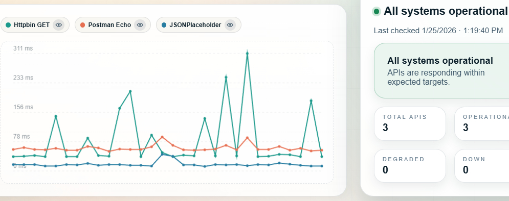

# API Vitals

<p align="center">
  
</p>

## Features
- Real-time API health checks with clear states
- Simple REST API for checks and endpoint management
- Latency measurement per endpoint and quick visual trends
- Endpoint management UI with expected status range + latency warning threshold
- Built-in **Simulated API** check for demoing different failure/latency scenarios
- Definitions are in-memory on the server; UI history/preferences stored in the browser

## Tech stack
- **Java 25**
- **Spring Boot 4.0.1** (Spring Web)
- **Thymeleaf** templates
- **Maven Wrapper** for consistent builds

## Setup
### 1) Requirements
- Install **Java 25**
- This repo includes the **Maven Wrapper** (no separate Maven install required)

### 2) Run the app
**Windows**
```bat
start.bat
```
